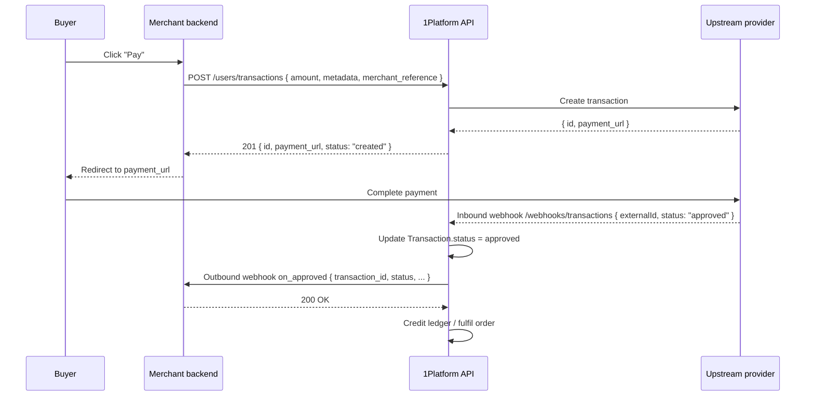

# Webhook Integration Overview

1Platform sends signed HTTP callbacks to your backend whenever a payment changes
state. This avoids polling and lets you fulfil orders, send receipts, or update
your CRM in near real time.

## Inbound vs outbound

| Direction | Endpoint | Who calls | Auth |
|---|---|---|---|
| **Inbound** (provider → 1Platform) | `POST /api/v1/webhooks/transactions` | Upstream payment provider | HMAC verified inside the API |
| **Outbound** (1Platform → merchant) | Whatever URL you register via `PUT /api/v1/webhooks/config/events` | 1Platform | HMAC signed; you verify before trusting |

This section is exclusively about the **outbound** path. The inbound path is an
implementation detail — you only see its consequences.

## Lifecycle events

Each transaction can fire one of five terminal events:

| Event | Meaning |
|---|---|
| `on_approved` | Buyer paid; funds settled |
| `on_denied` | Card declined |
| `on_cancelled` | Buyer abandoned the checkout window |
| `on_expired` | The `payment_url` timed out before payment |
| `on_dismiss` | Buyer closed the payment overlay |

You configure a separate URL per event via `PUT /webhooks/config/events`. All
five may point to the same endpoint — the canonical body's `event` field tells
you which one fired.

## End-to-end sequence

## What to read next

1. [Webhook security](./security) — HMAC scheme, headers, replay protection.
2. [Receiving notifications](./receiving-notifications) — canonical payload shape, status enum, FSM.
3. [Configuring URLs](./configuring-urls) — domain registration, event handlers, secret rotation.
4. [Retry & delivery](./retry-and-delivery) — at-least-once semantics, backoff, dead-letter.
5. [Code samples](./code-samples) — Python, TypeScript, PHP verifiers.
